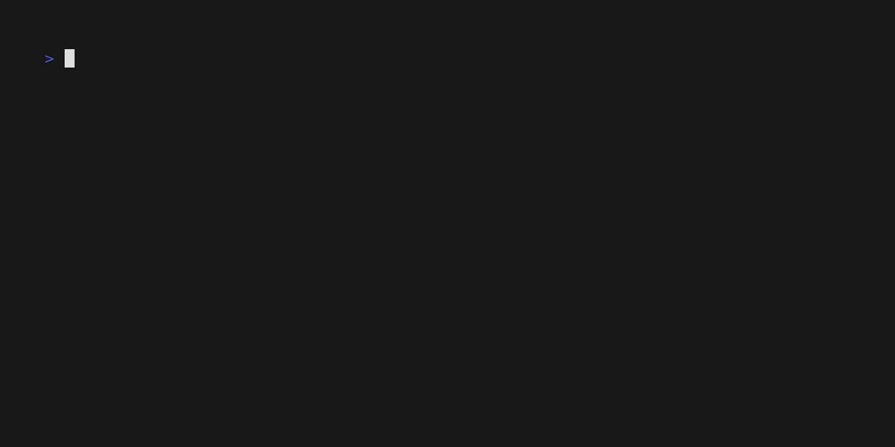

# cadence

Productivity timer for the terminal.
- Implemented in Go.
- Bubble Tea-based TUI frontend.
- Pomodoro state machine driving phase transitions.
- Desktop notifications on phase completion.

## Architecture
The pomodoro state machine is the system of record. It consumes commands (for example `start`, `stop`, `resume`) over channels, applies state transitions, and emits events after each mutation. The TUI is a client that subscribes to state updates and renders the latest snapshot. The notifications package is another subscriber, translating phase-complete events into desktop notifications. This event-driven split keeps the core logic isolated and will make it straightforward to add modules such as statistics or a web client in the future.

## Develop
Run the CLI locally with `go run ./cmd/cadence`. Run tests with `go test ./...`.

>You will not see logs in stdout because the TUI owns that stream. Pass `--debug` to write logs to your system cache or temp directory.
